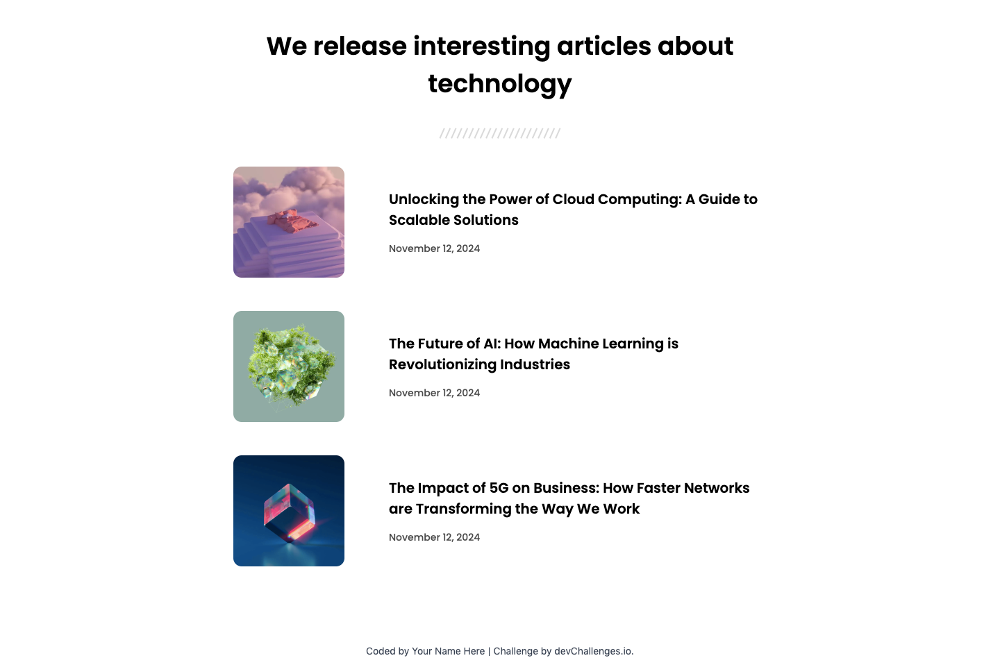

<h1 align="center">Mahdyar | devChallenges</h1>

   Solution for a challenge <a href="https://devchallenges.io/challenge/simple-article-listing" target="_blank">Simple Article Listing</a> from <a href="http://devchallenges.io" target="_blank">devChallenges.io</a>.

  <h3>
    <a href="{https://your-demo-link.your-domain}">
      Demo
    </a>
     | 
    <a href="{https://your-url-to-the-solution}">
      Solution
    </a>
     | 
    <a href="https://devchallenges.io/challenge/simple-article-listing">
      Challenge
    </a>
  </h3>

## Table of Contents

- [Overview](#overview)
- [Built with](#built-with)
- [Author](#author)

## Overview

### Built with

- Semantic HTML5 markup
- CSS custom properties
- Flexbox
- [Tailwind](https://tailwindcss.com/)

This application/site was created as a submission to a [DevChallenges](https://devchallenges.io/challenges-dashboard) challenge.

## Author

- GitHub [Mahdyrll](https://github.com/mahdyrll)
